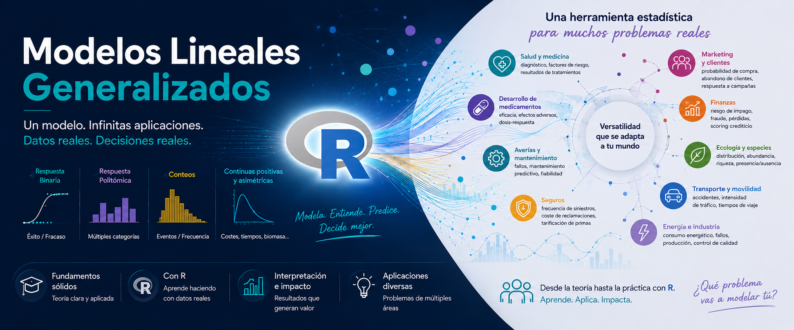
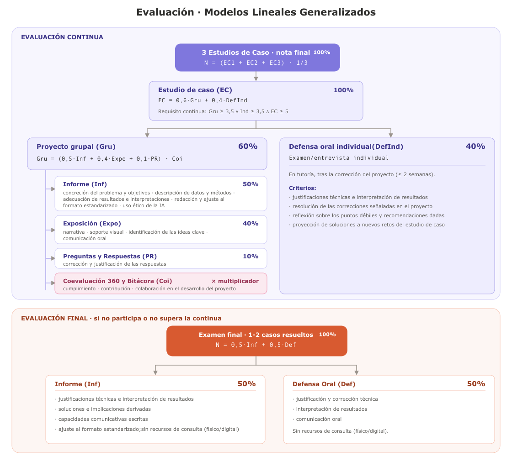
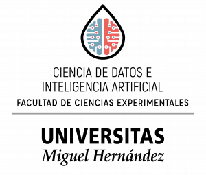

<!-- ============================================================================
     PORTADA del curso. Funciona como descriptor: los acordeones resumen la guía
     docente y cada uno enlaza a su apartado completo, para no duplicar texto.
     La barra lateral NO aparece aquí a propósito (esta página no está en
     `sidebar.contents` de _quarto.yml).
     PENDIENTE: los enlaces de entrega, en entregas.qmd.

     PÓSTER: el banner NO va de cabecera. Con su ratio 2,03 a todo ancho medía
     948 px de alto en una pantalla Full HD —más que la propia ventana— y la
     franja inferior caía bajo el pliegue. Va, por tanto, como ilustración a
     ancho de contenido (tope 1100 px => 458 px de alto), con la barra naranja
     normal encima. Al estar `lightbox: true` en _quarto.yml, se amplía al
     hacer clic, que es lo que una infografía densa necesita.
     El CSS de abajo vive SOLO en esta página.
============================================================================ -->

```{=html}
<style>
/* --- El póster de la portada -------------------------------------------- */
/* `page-layout: full` deja el contenido correr hasta el borde, así que la
   anchura la topamos aquí: 1100 px son 458 px de alto, media pantalla larga. */
.poster-glm {
  max-width: 1100px;
  margin: .5rem auto 2.75rem;
}
.poster-glm img {
  width: 100%;
  height: auto;
  display: block;
  border-radius: .6rem;
  box-shadow: 0 .5rem 1.5rem rgba(0, 12, 32, .16);
}
.poster-glm figcaption,
.poster-glm .figure-caption {
  text-align: center;
  font-size: .88rem;
  color: #5a5a5a;
  margin-top: .7rem;
}
</style>
```

::: {.poster-glm}
{fig-alt="Infografía del curso. A la izquierda, el título «Modelos Lineales Generalizados» sobre fondo azul, el logotipo de R y cuatro tipos de respuesta: binaria (éxito/fracaso), politómica (múltiples categorías), conteos (eventos y frecuencia) y continuas positivas (costes, tiempos, biomasa). A la derecha, diez ámbitos de aplicación: salud y medicina, desarrollo de medicamentos, averías y mantenimiento, seguros, marketing y clientes, finanzas, ecología y especies, transporte y movilidad, energía e industria."}
:::

Asignatura de **tercer curso del Grado en Ciencia de Datos e Inteligencia Artificial** de la Universidad
Miguel Hernández. Seis créditos ECTS, quince semanas de clases presenciales, y programación en R.

El enfoque consiste en plantear un problema concreto sobre el que el modelo lineal
clásico falla de forma evidente. La teoría entra a demanda para resolver ese problema desde la perspectiva de los modelos lineales generalizados (MLG o GLM en inglés -*Generalized Linear Models*-) para distintos tipos de respuesta. Se incorporan además los efectos mixtos y la supervivencia, para resolverla desde una perspectiva clásica y también con GLMs. El curso se dinamiza en torno a tres unidades, cada una basada en un Estudio de Caso que se resuelve, y al finalizar la teoría se propone otro estudio de caso para trabajar en equipos, exponer y defender por el estudiantado. 

## Los tres casos

```{=html}
<div class="rejilla-casos">

  <a href="caso1/caso1_binaria.html" class="tarjeta-caso">
    <div class="etiqueta">Caso 1 · Semanas 1–5</div>
    <div class="pregunta">¿Ocurre el evento? ¿Y cuándo?</div>
    <p class="detalle">Respuestas binarias y tiempo hasta el evento: del fallo del modelo lineal al
    marco GLM, regresión logística, evaluación de clasificadores, respuestas politómicas, efectos
    aleatorios y la entrada a la supervivencia en tiempo discreto.</p>
  </a>

  <a href="caso2/caso2_conteos.html" class="tarjeta-caso">
    <div class="etiqueta">Caso 2 · Semanas 6–10</div>
    <div class="pregunta">¿Cuántas veces y a qué ritmo?</div>
    <p class="detalle">Conteos y tasas sobre una cartera de seguro: Poisson con <em>offset</em> e
    IRR, modelos log-lineales, sobredispersión, exceso de ceros, GLMM, riesgos a trozos y
    regularización.</p>
  </a>

  <a href="caso3/caso3_continuas_positivas.html" class="tarjeta-caso">
    <div class="etiqueta">Caso 3 · Semanas 11–15</div>
    <div class="pregunta">¿Cuánto y hasta cuándo?</div>
    <p class="detalle">Magnitudes positivas y vida útil: GLM Gamma e inversa gaussiana, la familia
    Tweedie para el coste agregado con ceros, modelos AFT con censura y el modelo de Cox como
    frontera del marco.</p>
  </a>

</div>
```

## Recursos del curso

```{=html}
<div class="fila-botones">
  <a href="guia_docente_simplificada.html" class="boton-recurso">Guía docente completa</a>
  <a href="entregas.html" class="boton-recurso">Entregas y seguimiento</a>
  <a href="https://github.com/asunmayoral/GLM/tree/master/evaluacion/Plantillas_informes_tres_formatos" class="boton-recurso">Plantillas de informe</a>
  <a href="https://github.com/asunmayoral/GLM/tree/master/evaluacion" class="boton-recurso">Rúbricas de evaluación</a>
  <a href="referencias.html" class="boton-recurso">Referencias</a>
</div>
```

## La asignatura en cinco preguntas:

::: {.callout-note .acordeon collapse="true" icon=false}
## 1. Qué son los Modelos Lineales Generalizados y para qué sirven

Cada día se generan enormes cantidades de datos procedentes de ámbitos tan diversos como la medicina, la ingeniería, la biología, los seguros, el marketing o las ciencias ambientales. Sin embargo, muchas de las variables que queremos estudiar no son continuas ni siguen una distribución normal: un paciente puede responder o no a un tratamiento, una máquina puede sufrir un determinado número de averías, un cliente puede elegir entre varias opciones de compra o el coste de un siniestro puede ser siempre positivo y presentar una fuerte asimetría.

Los modelos lineales generalizados (MLG) constituyen una de las herramientas estadísticas más versátiles para analizar este tipo de datos. Amplían las posibilidades de la regresión lineal clásica permitiendo modelizar variables respuesta de naturaleza muy diferente, como respuestas binarias, variables con múltiples categorías, datos de conteo o variables continuas positivas y asimétricas. Gracias a ello, ofrecen un marco común para abordar una gran variedad de problemas mediante modelos adaptados a las características de los datos.

Su campo de aplicación es extraordinariamente amplio. Se utilizan para predecir la aparición de enfermedades y evaluar la eficacia de nuevos medicamentos; estimar el riesgo de averías y planificar el mantenimiento de equipos industriales; calcular primas de seguros a partir de la frecuencia y el coste de los siniestros; analizar la distribución de especies y los efectos del cambio climático; estudiar el comportamiento de consumidores, detectar fraude financiero, estimar la demanda energética o modelizar accidentes de tráfico, entre muchas otras aplicaciones.


:::

::: {.callout-note .acordeon collapse="true" icon=false}
## 2. Qué vas a aprender

El hilo conductor es el ciclo completo de modelización lineal, más allá del modelo normal de regresión, esto es, con respuesta no necesariamente normal: procedemos del dato al
modelo, del modelo al diagnóstico, y del diagnóstico a la interpretación y finalmente la comunicación. Trabajamos el **modelo lineal generalizado** (GLM) con efectos fijos, pero también con estructuras de agrupamiento e interconexión que nos llevan a modelos mixtos (con efectos aleatorios); y finalmente conectamos y trascendemos estos modelos -en cada tipo de respuesta- para trabajar problemas relacionados con la supervivencia o tiempos hasta evento.

Los objetivos de aprendizaje de este curso son: 

- **O1** . **Reconocer el marco común de los GLM.** Estructura común (familia exponencial, predictor lineal, función de enlace) y justificación de cuándo un dato exige un GLM frente a OLS. 
- **O2**  **Respuestas binarias y politómicas.** Logística y binomial agrupada, politómica nominal y ordinal: *odds ratios* y probabilidades, separación y calibración, selección por *deviance* y AIC/BIC. 
- **O3** . **Conteos y tasas.** Poisson y binomial negativa con *offset*: razones de tasas, sobredispersión, exceso de ceros, y selección por AIC/BIC, validación cruzada y regularización. 
- **O4**. **Magnitudes positivas y vida útil.** Gamma y log-normal con enlace log, **Tweedie** para importes agregados con ceros, y modelos **AFT**: interpretación multiplicativa y diagnóstico del ajuste. 
- **O5** . **Extender a mixtos y supervivencia.** GLMM sobre datos agrupados y tiempo-a-evento censurado (tiempo discreto, riesgos a trozos, AFT), con **Cox** como frontera del marco. Dos hilos en espiral. 
- **O6** . **Comunicar y reproducir.** Desarrollar, presentar y defender estudios de caso reproducibles ante audiencias técnicas y profesionales, en distintos formatos. 

Y cuatro son las preguntas en torno a las cuales se ordena el curso:

| ¿Qué mides? | Distribuciones | Dónde aparece | En el curso |
|:---|:---|:---|:--:|
| **¿Ocurre un evento?** — y, si ocurre, ¿de qué clase o en qué grado? | Bernouilli, binomial, politómica nominal y ordinal, riesgo y Kaplan Meier | diagnóstico clínico, riesgo de impago, probabilidad de compra, pieza defectuosa, presencia de una especie, intención de voto | Caso 1 |
| **¿Cuántas veces y a qué ritmo?** | Poisson, binomial negativa, multinomial y tablas de contingencia, ceros inflados, riesgos a trozos y Cox | ingresos hospitalarios, siniestros de una cartera, accidentes de tráfico, fallos de red, incendios forestales, goles | Caso 2 |
| **¿Qué coste genera?** — una magnitud estrictamente positiva | Gamma, inversa gaussiana, Tweedie, AFT, Cox | coste de una reclamación, importe de una reparación, consumo energético, rendimiento de un cultivo | Caso 3 |
| **¿Cuándo ocurre?** — sabiendo que a muchos aún no les ha pasado | Weibull y demás AFT, Cox | supervivencia de un paciente, vida útil de un equipo, abandono de clientes, duración de una póliza | 1.5 · 2.6 · 3.5–3.6 |


Amplía información en la [Guía Docente](https://www.umh.es/contenido/Estudios/:asi_g_8370_O1/datos_es.html) de la asignatura.
:::

::: {.callout-note .acordeon collapse="true" icon=false}
## 3. Qué conocimientos y habilidades necesitarás y desarrollarás

Te vendrán genial tus conocimientos de cálculo, álgebra lineal, probabilidad e inferencia básica, regresión lineal y soltura programando. No hace falta experiencia previa en R, pues se introducirá secuencialmente y podrás contar con la ayuda de LLMs para la generación de código. 

La asignatura capacita para **elegir, ajustar, diagnosticar e interpretar** el GLM adecuado a cada
tipo de respuesta, con respuesta individualizada o agrupada, y para reconocer los datos **censurados de tiempo-a-evento** como casos especiales del propio marco. Esta asignatura te proporciona una formación diferencial a la del resto de profesionales vinculados al tratamiento (ciencia) de datos. 

Se espera de ti que mejores tu razonamiento crítico, así como tus habilidades para aprovechar las inteligencias artificiales en la programación, la resolución de problemas, la documentación y el trabajo riguroso bajo criterios de validación y reproducibilidad. Aprenderás a escribir documentos e informes técnicos, ejecutivos y científicos, y mejorarás tus habilidades de exposición oral a públicos diversos. Desarrollarás capacidades de trabajo en equipo.
:::


::: {.callout-note .acordeon collapse="true" icon=false}
## 4. Cómo se trabaja en clase

**Cuatro horas semanales en dos sesiones de dos horas.** Estructuramos el curso en 3 bloques, cada uno de los cuales parte de un problema específico para un caso con datos simulados, y ciertas preguntas a responder. Justificamos la teoría, modelo o técnica que lo resuelve, e inmediatamente la aplicamos al estudio de caso conductor. Programamos juntos, predecimos qué va a salir antes de ejecutar, y discutimos por qué la salida dice lo que dice. Vamos comprendiendo, planteando/resolviendo dudas y detectando/corrigiendo errores. Al final de cada sección trabajáis en equipo sobre el estudio de caso para evaluación, utilizando las pistas dadas y el acompañamiento docente. Aprendemos interaccionando y cuestionando todo.

**Qué se espera de ti.** Este curso funcionará de modo óptimo si eres proactivo/a y tienes ganas sinceras de aprender. No funcionará si esperas que tu equipo trabaje por ti y no motivas tu curiosidad para cuestionarte todo lo que vamos abarcando. Durante el curso irás asumiendo distintos roles en el equipo, para promover tu capacidad de adaptación al trabajo en equipo y el desarrollo de ditintas habilidades (coordinador, revisor, portavoz, programador, escéptico, escriba, ...); aprovecha las oportunidades.

**Herramientas.** Trabajamos todo el curso con R+RStudio y [Github](https://github.com) como plataforma de programación colaborativa. También pruedes trabajar con otras plataformas colaborativas y comunicativas de la suite de Google, y por supuesto, con LLMs. La generación de código y redacción de informes la realizamos con cuadernos de Quarto Markdown. Para la creación de presentaciones puedes utilizar otras herramientas específicas asistidas con IA como NotebookLM, Gamma, ... u otros LLMs.

**El papel de la IA.** La IA es una herramienta de trabajo legítima, con la condición de que "eres responsable de todo lo que entregas tú y tu equipo, y en consecuencia tienes que poder defenderlo con soltura; si no sabes explicar por qué vuestro código hace lo que hace, el trabajo realizado no tendrá valor".

:::


::: {.callout-note .acordeon collapse="true" icon=false}
## 5. ¿Cuál es la planificación del curso?

Quince semanas y **60 horas de clase**, dos sesiones de dos horas por semana. La asignatura se compone de tres bloques -cada uno basado en un caso desarrollado y un trabajo grupal que se propone para evaluación- y tras cada bloque se destina una semana para las defensas del trabajo en equipo.

| Sem. | Bloque | Teoría (2 h) | Laboratorio (2 h) | Unidades |
|:--:|:--:|:--|:--|:--:|
| 1 | Caso 1 | OLS falla en binaria; los tres componentes del GLM | Refresco de R/tidyverse; primer `glm(binomial)` | 1.1 |
| 2 | Caso 1 | Familia exponencial y enlace; MV e IWLS; *deviance* | `family()`, enlaces logit/probit; lectura del `summary` | 1.2 |
| 3 | Caso 1 | Inferencia (Wald, LRT, AIC/BIC); OR y efectos marginales; evaluación de clasificadores | `marginaleffects`, `emmeans`, `pROC`, `DHARMa` | 1.2 |
| 4 | Caso 1 | Politómicas; datos agrupados (efectos aleatorios); tiempo discreto y *hazard* | `nnet`/`MASS`; `glmer`; persona-periodo con `cloglog` | 1.3–1.5 |
| 5 | Caso 1 | — | **Estudio de caso**, exposiciones y defensas | 1.6 |
| 6 | Caso 2 | Poisson; tasas, *offset* e IRR; inferencia y predicción | `glm(poisson)` + *offset*; `marginaleffects` | 2.1 |
| 7 | Caso 2 | Modelos log-lineales para tablas; sobredispersión | Tablas de contingencia y cuadradas; `glm.nb`, quasi-Poisson | 2.2, 2.3 |
| 8 | Caso 2 | Exceso de ceros; conteos agrupados | `pscl`/`glmmTMB`; `glmer`; ICC y BLUP | 2.4, 2.5 |
| 9 | Caso 2 | Riesgos a trozos ≡ Poisson; selección, CV y regularización | Persona-periodo; `glmnet`, `cv.glmnet` | 2.6, 2.7 |
| 10 | Caso 2 | — | **Estudio de caso**, exposiciones y defensas | 2.8 |
| 11 | Caso 3 | Gamma e inversa gaussiana; enlaces; media-varianza y log-OLS | `glm(Gamma(link="log"))`; *smearing*; comparación por AIC | 3.1, 3.2 |
| 12 | Caso 3 | GLMM Gamma; la familia **Tweedie** y el índice $p$ | `glmmTMB` (Gamma y `tweedie`); `DHARMa`; `group_vfold_cv` | 3.3, 3.4 |
| 13 | Caso 3 | Tiempo hasta el fallo: censura y modelos **AFT** | `Surv`, `survfit`, `survreg`; `survminer` | 3.5 |
| 14 | Caso 3 | **Cox** como frontera y proporcionalidad; las tres lentes y las fronteras del marco | `coxph`, `frailty`, `cox.zph`; comparación de las tres lentes | 3.6, 3.7 |
| 15 | Caso 3 | — | **Estudio de caso**, exposiciones, defensas y cierre | 3.8 |
:::

::: {.callout-note .acordeon collapse="true" icon=false}
## 6. Cómo se evalúa


::: {.poster-glm}
{fig-alt="Evaluación. Evaluación continua. Requiere compromiso y seguimiento sostenido. Es sumativa y se construye sobre tres proyectos grupales equitativos —uno por bloque—, en equipos cooperativos de un máximo de tres personas con roles rotativos, coevaluación 360 sobre implicación en el trabajo y cumplimentación de una bitácora de aprendizaje. El proyecto grupal pesa un 60% (ponderado por la coevaluación) y la defensa oral individual un 40%. Para superar la evaluación continua se exige un mínimo de 3.5/10 en cada prueba (grupal e individual) y una media ponderada $\geq 5$. Evaluación final, para quien no participe o no supere la evaluación continua, en convocatoria ordinaria o extraordinaria: un examen final que aporta el 100 % de la calificación, planteado a partir de uno o varios estudios de caso resueltos total o parcialmente, sobre los que se ha de desarrollar un informe escrito (50 %) -justificando e interpretando los resultados- y su defensa oral (50 %). No se permitirán recursos de consulta."}
:::

Amplía información en la [Guía Docente](https://www.umh.es/contenido/Estudios/:asi_g_8370_O1/datos_es.html) de la asignatura.
:::

::: {.callout-note .acordeon collapse="true" icon=false}
## 7. En qué consisten y cómo se trabaja en los proyectos grupales

Se trabaja en equipos cooperativos sobre unos datos dados (cada equipo recibe datos distintos) para responder las preguntas planteadas a partir de la modelización y análisis pertinente. A lo largo del bloque teórico del Caso, se van introduciendo las diferentes cuestiones sobre el caso, con pistas e indicaciones para resolverlo, de modo que puedes ir practicando lo aprendido y resolviendo a la vez el trabajo grupal. 

En el equipo cada estudiante asume un **rol** con tareas definidas, que **rota** de un proyecto al siguiente para reforzar y mejorar todas sus habilidades para el trabajo en equipo:

- **Coordinación** — planificación, supervisión, consultas, gestión de repositorios/bitácora, exposición.
- **Análisis** — tratamiento de datos, modelización, generación de código reproducible y validación técnica (diagnóstico).
- **Redacción** — redacción informe y presentación.


Cada proyecto se desarrolla en un formato distinto para que domines las situaciones posibles en el mundo profesional, y se acompaña de una exposición grupal (sobre una presentación) y una entrevista/examen individual -tras la corrección del informe- en la que has de demostrar que dominas todo el análisis realizado y puedes dar respuesta, matices o proyecciones a las correcciones/comentarios realizados por el profesorado sobre el informe.

| Bloque | Formato del informe |
|:--:|:--|
| Caso 1 | Informe **técnico**, dirigido a técnicos |
| Caso 2 | Informe **ejecutivo**, dirigido a directivos |
| Caso 3 | **Artículo de investigación**, dirigido a investigadores y académicos. |

**Infraestructura**

Para la generación de los proyectos el profesorado compartirá contigo un repositorio de trabajo para el equipo en GitHub, donde tienes un documento con todas las instrucciones. Alojarás allí todos los documentos generados con el proyecto y el coordinador del equipo mantendrá la bitácora. La entrega de la tarea se detalla en dichas instrucciones, así como el acceso a la revisión del profesorado.

**Uso ético de la IA**
Asumimos que la utilizarás. Todo informe incluye un apartado **obligatorio** de reflexión sobre el uso de la IA: qué herramientas
se usaron y para qué, prompts relevantes si es pertinente, y **cómo se verificaron sus respuestas**. Sin ese apartado, el informe no puede
alcanzar la calificación de «excelente».
:::

::: {.callout-note .acordeon collapse="true" icon=false}
## 8. Cómo se evalúa la individualidad

Una coevaluación 360 sobre el trabajo realizado por cada miembro del equipo pondera la calificación del proyecto grupal (contribución 60%). El examen/entrevista individual aporta el 40% de la calificación de cada proyecto, y en ella habrás de demostrar que conoces a la perfección todo el desarrollo del proyecto. El proyecto grupal (60% de la calificación) acaba ponderado por un factor corrector *Coi* que se obtiene de la **coevaluación 360** en cada proyecto, contrastada con la **bitácora** y con la evidencia de contribución (*commits*, versiones, actas).

### **Coevaluación 360**

Cada estudiante valora a **cada uno de sus compañeros y también a sí mismo** en dos preguntas, que
separan lo que hizo *por su cuenta* de lo que hizo *hacia los demás*:

| | Pregunta | Dimensiones que recoge | Peso |
|:--:|:--|:--|:--:|
| $P_1$ | ¿Sacó adelante el trabajo que le correspondía, y en las fechas acordadas? | Cumplimiento y contribución | 2 |
| $P_2$ | ¿Facilitó el trabajo de sus compañeros? | Colaboración | 1 |

La escala es la misma **0–3** que emplean las rúbricas del curso, sin punto medio neutro, y su
referencia es siempre quién acabó haciendo el trabajo:
 | | Nivel | Significado |
|:--:|:--|:--|
| **3** | Plenamente | Asumió por completo lo que le correspondía; nadie tuvo que suplirle |
| **2** | En gran parte | Cumplió en lo esencial, pero hubo que reclamarle o rehacer alguna parte |
| **1** | A medias | Una parte apreciable de lo suyo la acabaron asumiendo otros |
| **0** | Apenas o nada | Su aportación fue testimonial o inexistente |

### Cálculo del Coi

Sea $s_{ij} = (2P_1 + P_2)/3$ la **media ponderada** de las puntuaciones que el estudiante $i$ otorga
a su compañero $j$, y $n$ el tamaño del equipo. El procedimiento adapta el algoritmo del sistema
WebPA [@loddington2009].

**1. Cada evaluador reparte, no califica.** Se normaliza lo que cada quien emite, de modo que su
severidad o generosidad deja de influir en el resultado:

$$\omega_{ij} \;=\; \frac{s_{ij}}{\sum_{k} s_{ik}}\,n$$

El índice vale 1 cuando $i$ considera que $j$ aportó lo que le correspondía, y se aparta de 1 hacia
arriba o hacia abajo según lo aportara en mayor o menor medida. Quien valora igual a todo el equipo
emite $\omega = 1$ para todos: no establece diferencias, luego no aporta información.

**2. Se agregan las valoraciones recibidas** mediante la mediana,
$R_j = \operatorname{mediana}_i(\omega_{ij})$. Al incluir la autoevaluación, cada estudiante recibe
tres valoraciones y la mediana adquiere una propiedad decisiva en equipos de tres: **hacen falta dos
coincidencias para mover el resultado**. Una valoración hostil aislada queda fuera, y nadie puede
salvarse con su propio voto.

**3. Se convierte en factor:**

$$w_j \;=\; \min\!\left(1,\; \frac{R_j}{0{,}80}\right)$$

Es una función continua y acotada en $[0, 1]$: no hay bandas ni escalones, y una diferencia mínima en
las puntuaciones no puede producir una caída brusca de la nota. El umbral 0,80 actúa como **franja de
indiferencia**: hasta un 20 % de desigualdad percibida no penaliza, porque ningún equipo reparte el
trabajo en partes exactamente iguales.

**Qué descuenta cada perfil de respuestas**

En un equipo de tres, la tabla recoge el factor que resulta para quien recibe las valoraciones
indicadas, cuando el equipo coincide y los otros dos son valorados *plenamente* en ambas preguntas:

| $P_1$ · su parte | $P_2$ · la de los demás | $s$ | $w$ |
|:--|:--|:--:|:--:|
| Plenamente | Plenamente | 3,00 | 1,00 |
| Plenamente | En gran parte | 2,67 | 1,00 |
| Plenamente | A medias | 2,33 | 1,00 |
| Plenamente | Apenas o nada | 2,00 | 0,94 |
| En gran parte | En gran parte | 2,00 | 0,94 |
| En gran parte | A medias | 1,67 | 0,82 |
| En gran parte | Apenas o nada | 1,33 | 0,68 |
| A medias | Plenamente | 1,67 | 0,82 |
| A medias | A medias | 1,00 | 0,54 |
| A medias | Apenas o nada | 0,67 | 0,38 |
| Apenas o nada | Plenamente | 1,00 | 0,54 |
| Apenas o nada | En gran parte | 0,67 | 0,38 |
| Apenas o nada | Apenas o nada | 0,00 | 0,00 |

Un nivel de diferencia respecto a los compañeros no descuenta nada; hacen falta dos niveles
sostenidos para que el factor se active de forma apreciable. El doble peso de $P_1$ impide que la
buena disposición compense la ausencia de trabajo: quien no sacó adelante nada de lo suyo no pasa de
$w = 0{,}54$ por muy bien que se llevara con el equipo.

**Salvaguardas**

- **La coevaluación activa la penalización; la evidencia la confirma.** Ningún $w < 1$ se aplica solo
con los votos de los compañeros: el profesorado lo contrasta con la bitácora y el historial de
contribución antes de fijarlo, atendiendo en particular a la discrepancia entre las valoraciones
recibidas. Una discrepancia amplia entre evaluadores no se promedia sin más: se resuelve.

- **No entregar la coevaluación** de algún miembro del equipo pospone la revisión hasta disponer de ella. 

- **Equipos de dos.** Cada persona recibe solo dos valoraciones y la mediana degenera en media: la
propiedad de las dos coincidencias se pierde y un único voto discrepante mueve el factor. Cualquier
$w < 1$ en un equipo de dos pasa automáticamente a revisión con la bitácora antes de aplicarse.

- **Reclamación.** El estudiante conoce su $w$ y las razones que lo sustentan antes de la publicación de
la nota, y puede aportar evidencia adicional en el examen oral individual.

- La **bitácora** recoge rol asumido, tareas realizadas, incidencias, uso de recursos (apuntes/IA),
percepción del aprendizaje y valoración global.


### Examen oral individual

Una vez obtenida la calificación individual en el proyecto grupal, se procede con una entrevista/defensa individual, en sesión de tutoría, en fecha posterior a la corrección del proyecto y no más de dos semanas después. Duración de **10 a 12 minutos**, sin apoyos salvo la propia presentación y el informe corregido. Tres bloques:

| Bloque | Contenido | Peso |
|:--:|:--|:--:|
| 1 | Justificación de respuestas e interpretación de algún resultado | 40 % |
| 2 | Solución a algún punto débil señalado en la corrección | 35 % |
| 3 | Extensión o nuevo reto sobre el problema ya resuelto | 25 % |
:::

::: {.callout-note .acordeon collapse="true" icon=false}
## 9. Cómo construir los informes y presentaciones

En ["Recursos/Plantillas"](/evaluacion/plantillas) y también en el repositorio de Github, dispones de plantillas de informe, así como de guías con recomendaciones para construir los informes y las presentaciones.
::

::: {.callout-note .acordeon collapse="true" icon=false}
## 10. Cuáles son los criterios de evaluación

En ["Recursos/Rúbricas"](/evaluacion/rubricas) dispones de las rúbricas y checklists que usaré en la evaluación de informes, presentaciones y entrevistas, así como las relativas al examen final, con sus criterios y ponderaciones, que se presentan a continuación. Todas las rúbricas usan la escala **0–3**. 

### Rúbricas de la evaluación continua

**Informe grupal**

| Criterio | Peso |
|:--|:--:|
| Problema, audiencia y objetivos | 20 % |
| Datos, método y reproducibilidad | 20 % |
| Resultados, visualización e interpretación | 30 % |
| Redacción, formato y referencias (APA 7) | 20 % |
| Uso ético de la IA | 10 % |

**Exposición y defensa grupal**

| Criterio | Peso |
|:--|:--:|
| Narrativa: hilo entre audiencia, contexto, resultados, implicaciones y cierre | 12,5 % |
| Soporte visual: estética y estructura de las diapositivas | 7,5 % |
| Foco: ideas clave, resultados y justificaciones | 12,5 % |
| Desempeño: oralidad, tiempos y decoro | 7,5 % |
| Defensa (Q&A): corrección y justificación de la respuesta | 10 % |

**Examen oral individual**

| Criterio | Peso |
|:--:|:--|:--:|
| **Justificaciones técnicas e interpretación**: la justificación de las respuestas dadas y la interpretación solicitada de resultados | 40 % |
|  **Solución a un punto débil**:| la solución a uno de los puntos débiles detectados en la corrección | 35 % |
| **Extensión / nuevos retos**: una extensión o un nuevo reto sobre el problema ya resuelto | 25 % |


## Rúbricas de la evaluación final

Aplicables **solo** en la evaluación final. No incluyen uso de IA ni referencias: el foco es técnico
y comunicativo.

| Informe (50 %) | Peso | | Defensa oral (50 %) | Peso |
|:--|:--:|:--:|:--|:--:|
| Justificaciones técnicas e interpretación | 35 % | | Justificación y corrección técnica de las respuestas a las preguntas | 40 % |
| Soluciones e implicaciones derivadas | 25 % | | Interpretación de resultados y en el contexto del problema | 35 % |
| Comunicación escrita: claridad, orden y precisión de la redacción | 20 % | | Comunicación oral: claridad, orden y precisión al exponer y responder | 25 % |
| Ajuste al formato estandarizado | 20 % | | | |
:::


## Cómo usar este sitio web

Cada caso es un **cuaderno reproducible** programado en R-Markdown: la teoría al servicio del problema, el **código R
visible** —puedes desplegarlo, y también descargarlo al finalizar el bloque— y la interpretación de cada resultado. La barra lateral
te lleva a cualquier unidad, y el índice de la derecha, a cualquier sección dentro de ella.

Dispones de acceso a la [Guía Docente](guia_docente_simplificada.qmd). Desde la pestaña Recursos también puedes a las rúbricas de evaluación y las plantillas para la redacción de informes, junto con guías con recomendaciones para generar presentaciones eficaces. También el seguimiento de proyectos, las entregas de trabajos y la coevaluación 360 está accesible en la web. 

Si empiezas de cero, empieza por el [Caso 1](caso1/caso1_binaria.qmd).

## Profesorado

Soy Asun Martínez Mayoral, profesora del Departamento de Estadística, Matemáticas e Informática en la Universidad Miguel
Hernández de Elche. Doctora en Ciencias Matemáticas, especialidad de Estadística e Investigación Operativa, por la Universitat de València (1998). Profesora titular de universidad desde 2008 (costó llegar). Aprendo y trabajo en Estadística, frecuentista, bayesiana y aprendizaje automático, aprovechando las IAs, pero también curioseo con la tecnología educativa y la divulgación científica. Imparto docencia actualmente en los Grados en Estadística Empresarial y Ciencia de Datos e Inteligencia Artificial, y en varios másteres, programas de doctorado y programas de formación de profesorado, enseñando variaditos sobre estadística, metodologías educativas, competencia digital, aprovechamiento de IAs y divulgación científica, para profesionales de distintos ámbitos.

### Contacto

| | |
|:--|:--|
| Correo y Chat (Google) | asun.mayoral@umh.es |
| Web personal |  [asunmayoral.umh.es](https://asunmayoral.umh.es)|
| Despacho | Edificio Torrepinet, planta 2. Campus de Elche. Avda. Universidad s/n, 03202 Elche|
| Tutorías | A convenir bajo demanda |
| ORCID | [0000-0001-6944-7335](https://orcid.org/0000-0001-6944-7335) |

## Sobre este material

Este sitio es material docente en abierto, con licenciamiento CC BY-SA, producido con acompañamiento de Claude Opus 4.8 y 5.0, escrito en [Quarto](https://quarto.org) y publicado desde
[GitHub](https://github.com/asunmayoral/GLM). Todo el código es reejecutable y los bancos de datos
están simulados con proceso generador conocido, de modo que cualquier resultado del curso puede
comprobarse contra la verdad que lo produjo.

Si detectas un error o quieres proponer una mejora, puedes
[abrir una incidencia](https://github.com/asunmayoral/GLM/issues) en el repositorio.
<!-- ============================================================================
     LOGOTIPOS. Activos: logo-umh.png y logo-grado.png, ambos con transparencia.
     La hoja de estilo (.logos-pie) los escala a 62 px de alto en fila centrada.
     Cuando el instituto tenga logo, guárdalo como images/logo-instituto.png y
     cambia el bloque activo por el que está comentado justo debajo.
============================================================================ -->


```{=html}
<div class="logos-pie">
  
  
</div>
```

<!--
```{=html}
<div class="logos-pie">
  
  
  
</div>
``` -->
